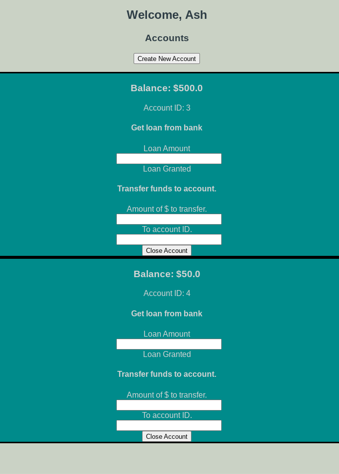

# bank
Web based banking app

# Project initialisation instructions.
# Open PostgreSQL
sudo -u postgres psql

## Create database
sudo -u postgres createdb bankdb

# Create database user
sudo -u postgres createuser bankuser --pwprompt

# On psql prompt, add privileges to access database.
grant all privileges on database bankdb to bankuser

# How to open bankdb database in psql:
database \c bankdb

# Drop all tables:
drop table transactions;drop table loans;drop table accounts;drop table bank;drop table users;